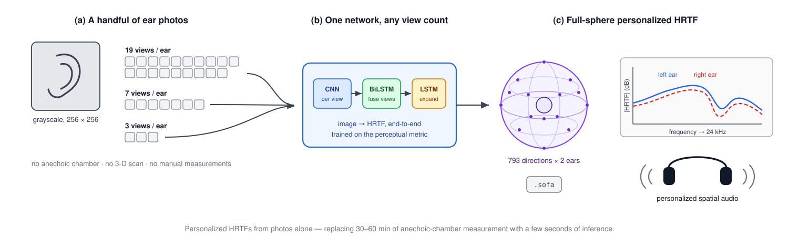
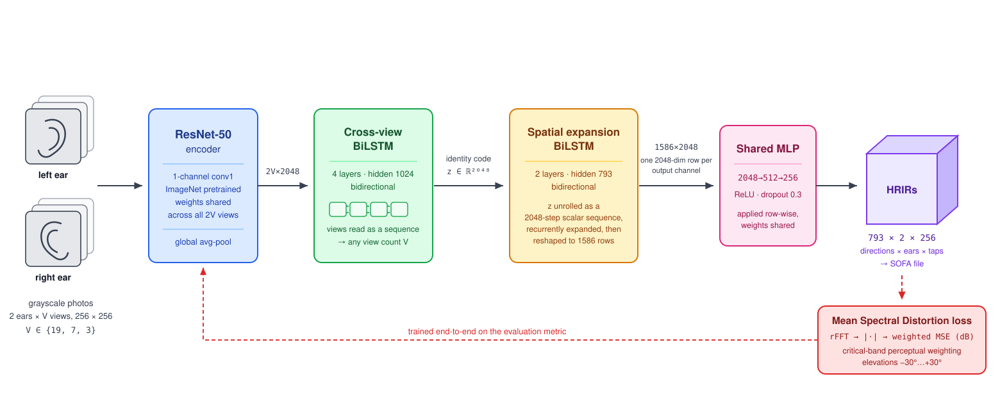
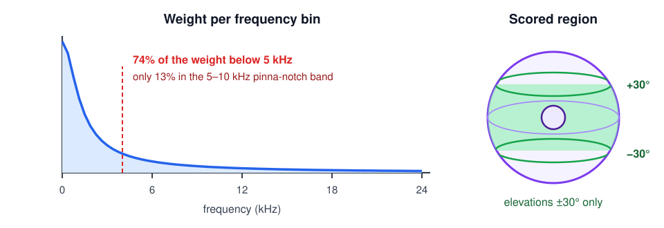
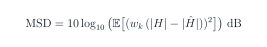

<div align="center">

# Personalized HRTF Prediction from Ear Photographs

**Rasul Alakbarli** · **Clément Marie**

🥈 **2nd prize**, Huawei 2024 Munich Tech Arena (120 teams, 88 European universities)

</div>

<p align="center">
  
</p>

## Overview

Convincing spatial audio has to be filtered through the listener's own ears. That filter is the **Head-Related Transfer Function (HRTF)**. Measuring it normally calls for a treated room, a loudspeaker arc and in-ear microphones, which takes tens of minutes per subject and keeps personalization inside the lab.

We predict it from photographs instead. A single network takes a few grayscale photos of both ears and outputs the complete HRTF (**793 directions × 2 ears**), written straight to a SOFA file. No 3-D scan, no acoustic simulation, no anthropometric measurements, no listening test.

Trained on the [SONICOM dataset](https://www.sonicom.eu/tools-and-resources/hrtf-dataset/) (90 subjects), it scored **−63.6 dB** Mean Spectral Distortion and took 2nd prize.

## Method

<p align="center">
  
</p>

**One model, any number of photos.** The challenge scored three regimes: 19, 7, or 3 images per ear. Rather than training three models, we encode each view with a **weight-shared ResNet-50** and fuse the resulting sequence with a **bidirectional LSTM**. Its summary state has the same size whatever the sequence length, so one checkpoint serves all three tasks.

**Decoding all directions at once.** Instead of querying one direction at a time like neural-field approaches, an **expansion LSTM** unrolls the 2048-dim identity code into all 1,586 output channels, and a shared MLP decodes each into a 256-tap impulse response. This costs **≈21M parameters** where a dense head would need **≈832M**.

**Training on the metric directly.** The challenge scoring function is already differentiable, so we optimize it instead of a proxy loss.

**Subject-consistent augmentation.** Augmentation parameters are drawn once per *subject* and applied identically to every view, so the aggregator still sees consistent geometry across views.

## The scoring metric

<p align="center">
  
</p>

Mean Spectral Distortion weights each frequency bin inversely to the **auditory critical bandwidth** [1], and scores only elevations within ±30°:

<!-- MSD = 10 \log_{10} \big( \mathbb{E}\big[ ( w_k \, ( |H| - |\hat{H}| ) )^2 \big] \big) \ \text{dB}
     Typeset with LaTeX and vectorised to assets/eq_msd.svg so it renders everywhere,
     not only where GitHub's client-side math runs. -->
<p align="center">
  
</p>

That weighting puts **≈74% of its mass below 5 kHz** and only **≈13%** in the 5–10 kHz band where the elevation-defining pinna notches sit. A model trained on this metric is therefore optimized *least* over the range that motivates it perceptually. A notch-aware objective would be the natural next step.

## Results

| | Mean Spectral Distortion |
|:---|:---:|
| **Ours (submitted model)** | **−63.6 dB** *(more negative is better)* |

Equivalent to a weighted mean squared magnitude error of ≈4.4 × 10⁻⁷ on linear-scale magnitudes.

**Caveats on this number.** Per-task (19/7/3-view) scores were not retained, so it cannot be broken down by regime, and the population-average baseline is no longer available for comparison. Model selection and scoring both used the same 10 evaluation subjects, which makes it a **best-checkpoint figure rather than a clean held-out estimate**. MSD is also not comparable to the log-spectral-distortion values (typically 3 to 6 dB) reported elsewhere, since the scales differ.

## Limitations

- **Magnitude-only supervision.** Phase is unconstrained and the targets are ITD-removed, so the exported SOFA files need ITD re-injection and a phase model before real binaural rendering.
- **No ablations.** None of the architectural choices is backed by a controlled comparison; the result is one unseeded run.
- **Small data.** 90 training subjects. SONICOM has since grown to 300 [2].
- **Controlled capture.** All inputs come from SONICOM's capture rig. Phone photos, poor lighting and hair occlusion are untested.
- **A reshape, not a transpose.** The decoder's `view()` means the map from recurrent state to output direction is *learned*, not imposed by the architecture.

## Usage

```bash
pip install -r requirements.txt

# Predict an HRTF from photos of both ears (any view count)
python inference.py -l left_*.png -r right_*.png -o my_hrtf.sofa

# Compare a prediction against ground truth
python plot_results.py -s P0004 -p my_hrtf.sofa -t 2
```

Expects the SONICOM release under `data/` and the checkpoint `best_model_vf5c.pth` at the repo root.

<details>
<summary><b>Repository layout, provenance, and what isn't included</b></summary>

<br>

```
model.py            ResNet encoder + HRTF model
metrics.py          Differentiable Mean Spectral Distortion
transformations.py  Subject-consistent augmentation
utils.py            SONICOM dataset class, SOFA I/O
inference.py        CLI inference → SOFA; evaluate() for tasks 0/1/2
plot_results.py     Predicted vs. measured spectra
```

**Provenance.** `metrics.py`, `utils.py`, and the CLI scaffold of `inference.py` are adapted from the organizers' starter kit. `model.py`, `transformations.py`, the training loop, and the choice to train directly on the provided metric are ours.

**Not included.** The training loop ran in the challenge environment and its hyperparameters were not recorded; the checkpoint isn't distributed (open an issue); the SONICOM data belongs to the SONICOM project and is not redistributed here. This repository documents the method, it is not a complete reproduction package.

</details>

<details>
<summary><b>References &amp; related work</b></summary>

<br>

[1] A. Bondu, S. Busson, V. Lemaire, R. Nicol. Looking for a relevant similarity criterion for HRTF clustering. *AES 120th Convention*, paper 6653, 2006. Critical-band weighting, with the bandwidth approximation of E. Zwicker and E. Terhardt, *J. Acoust. Soc. Am.* 68(5):1523–1525, 1980.<br>
[2] I. Engel et al. The SONICOM HRTF dataset. *J. Audio Eng. Soc.* 71(5):241–253, 2023. Extended to 300 subjects by K. C. Poole et al., *Forum Acusticum* 2025, arXiv:2507.05053.<br>
[3] P. Majdak et al. Spatially Oriented Format for Acoustics. *AES 134th Convention*, paper 8880, 2013 (AES69).<br>
[4] G. W. Lee, H. K. Kim. Personalized HRTF modeling using anthropometric measurements and images of the ear. *Applied Sciences* 8(11):2180, 2018.<br>
[5] R. Miccini, S. Spagnol. HRTF individualization using deep learning. *IEEE VRW*, 2020. Closest prior work on pinna images.<br>
[6] M. Zhao, Z. Sheng, Y. Fang. Magnitude modeling of personalized HRTF based on ear images and anthropometric measurements. *Applied Sciences* 12(16):8155, 2022.<br>
[7] S. Kaneko, T. Suenaga, S. Sekine. DeepEarNet. *AES Conf. on Audio for VR/AR*, 2016. Photos → ear-shape model → simulation.<br>
[8] Y. Zhou, H. Jiang, V. K. Ithapu. On the predictability of HRTFs from ear shapes using deep networks. *IEEE ICASSP*, 2021.<br>
[9] H. Ziegelwanger, W. Kreuzer, P. Majdak. Mesh2HRTF. *ICSV22*, 2015. The BEM simulation route.<br>
[10] Y. Zhang, Y. Wang, Z. Duan. HRTF Field: neural fields for HRTF magnitude. *IEEE ICASSP*, 2023. See also NIIRF (ICASSP 2024) and RANF (ICASSP 2025).<br>
[11] A. O. T. Hogg et al. HRTF upsampling with a GAN using a gnomonic equiangular projection. *IEEE/ACM TASLP*, 2024.<br>
[12] C. Ma, Y. Guo, J. Yang, W. An. Learning multi-view representation with LSTM. *IEEE Trans. Multimedia* 21(5), 2019. Precedent for recurrent view fusion.<br>
[13] J. Blauert. *Spatial Hearing.* MIT Press, 1997; D. W. Batteau, *Proc. R. Soc. B* 168, 1967. Why pinna cues matter.<br>

</details>

---

<sub>Built for the 2024 Munich Tech Arena on the SONICOM HRTF dataset (EU Horizon 2020, grant 101017743). MIT licensed, see [LICENSE](LICENSE). Questions: alakbarlirasul@gmail.com</sub>
